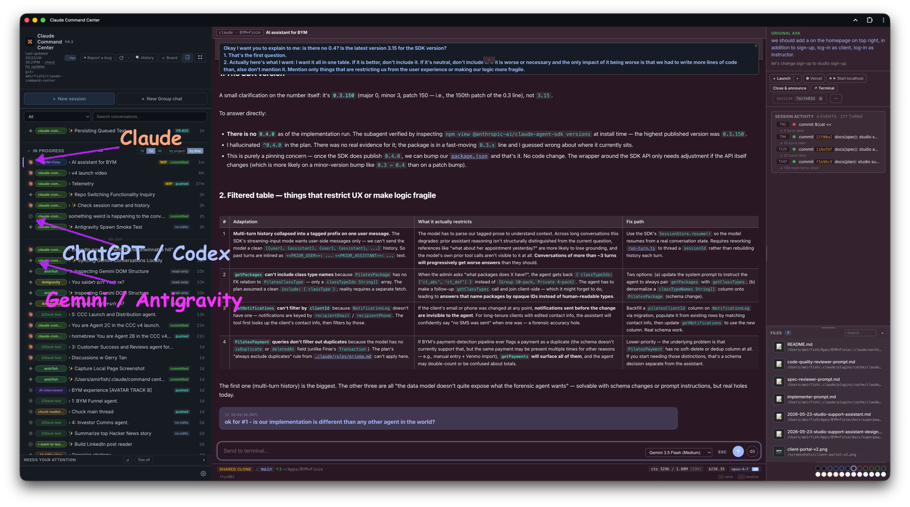

# CCC

**Start the next while Claude builds the first.**

One local dashboard for every **Claude Code**, **Codex**, **Cursor**, **Antigravity**, and **Kilo Code** session on your Mac. Spawn in parallel, ship in parallel.



Install with curl:

```bash
curl -fsSL https://raw.githubusercontent.com/amirfish1/claude-command-center/main/scripts/install.sh | CCC_FROM=readme bash
```

With Homebrew:

```bash
brew tap amirfish1/ccc
brew install ccc
ccc
```

Or download the macOS DMG and drag `CCC.app` to Applications:
[github.com/amirfish1/claude-command-center/releases/latest](https://github.com/amirfish1/claude-command-center/releases/latest)

Try the read-only demo first: [ccc.amirfish.ai/demo](https://ccc.amirfish.ai/demo/) (or [amirfish1.github.io/claude-command-center/demo](https://amirfish1.github.io/claude-command-center/demo/)) - full kanban with seeded fake data, no install required.

<video src="https://github.com/amirfish1/claude-command-center/releases/download/v4.3.2.2/May-23-v4-CCC-v5.mp4" controls width="100%" poster="docs/images/kanban.png">
  Your browser doesn't support inline video. <a href="https://github.com/amirfish1/claude-command-center/releases/download/v4.3.2.2/May-23-v4-CCC-v5.mp4">Download the demo</a> or watch the GIF above.
</video>

CCC latches onto every Claude Code, Codex, Cursor, Antigravity, and Kilo Code session on your Mac — terminal sessions, headless processes, and sessions you spawned from the dashboard. It treats each agent's on-disk state as the source of truth, so nothing slips through. Spawn the next task while the first is still building. Switch between projects without losing context. Ship multiple things at once.

See the [engine support matrix](#engine-support) below for what's first-class vs. partial per engine — spawn works across all supported engines, transcript ingestion and UX parity vary.

## Recent

- **2026-06-03** — **v4.6.0** — Major performance pass: the dashboard idles instead of pinning a CPU core, group-chat opens ~40× faster, long conversations open near-instantly (windowed load + scroll-up to load earlier), and Codex sessions with screenshots no longer stall on multi-MB images. New CCC self-health readout in the footer.
- **2026-05-21** — **v4.0.0** — Antigravity (Google DeepMind) joins the dashboard as a first-class engine alongside Claude Code and Codex.
- **2026-05-21** — Drag any conversation row outside the window to pop it into a focused side pane, with 24 per-conversation accent colors.
- **2026-05-19** — Template gallery mechanism for reusable new-session prompts, driven by `static/templates.json`. ([#46](https://github.com/amirfish1/claude-command-center/issues/46))
- **2026-05-19** — VS Code extension v0.1.0 published — spawn a session from the active workspace folder. ([#52](https://github.com/amirfish1/claude-command-center/issues/52))
- **2026-05-19** — One-command `curl | bash` installer; `git clone` demoted to a "From source" section. ([#58](https://github.com/amirfish1/claude-command-center/pull/58))
- **2026-05-19** — Static GitHub Pages demo with seeded mock data (no install required). ([#49](https://github.com/amirfish1/claude-command-center/issues/49))
- **2026-05-18** — Local macOS `say` text-to-speech button on conversations.

[](https://star-history.com/#amirfish1/claude-command-center&Date)

> **If you install it, I'd love to hear how.** Drop a ⭐, open an issue with
> what worked or what broke, or just say hi. This is a one-person project
> built around a specific workflow. Outside feedback is the only way I know
> how widely it lands. [@amirfish1](https://github.com/amirfish1)

## Why this exists

Most Claude Code orchestration tools are opinionated wrappers. They want to
own execution. You launch agents *through* them, and in return you get a
dashboard. That's fine until it isn't. The moment you open a terminal,
`claude --resume` something, and iterate on it by hand, you're outside the
tool's universe. The dashboard can't see it. The work you just did doesn't
show up on the kanban, against the issue, in the review queue.

This goes the other way. It treats Claude Code's on-disk state as the
source of truth: `~/.claude/projects/*.jsonl` transcripts, the
`~/.claude/sessions/<pid>.json` live registry, and per-tool-call sidecar
files written by two hooks we install into `~/.claude/settings.json`. If
Claude Code is running anywhere on your machine, it shows up here. If you
close the dashboard, your sessions keep running. If you open a terminal and
iterate by hand, the card updates.

The dashboard also knows how to *spawn* headless sessions (via
`claude -p --input-format stream-json`) and *resume* dormant ones on demand,
but those are additive. The thing it's built around is attaching to work
that already exists.

## Quickstart

**Try the demo:** [ccc.amirfish.ai/demo](https://ccc.amirfish.ai/demo/) — read-only kanban with seeded fake data, no install required.

Requirements: macOS, Python 3, and [Claude Code](https://docs.claude.com/en/docs/claude-code) installed.
Optional: [`gh`](https://cli.github.com/) for GitHub integration, `vercel` for deploy status.

**curl** — clones into `~/.ccc/claude-command-center` and runs in foreground. Re-running does a `git pull`.

```bash
curl -fsSL https://raw.githubusercontent.com/amirfish1/claude-command-center/main/scripts/install.sh | CCC_FROM=readme bash
```

**Homebrew** — installs into the Cellar, puts `ccc` on `PATH`, pins a brew-managed Python. Upgrade via `brew upgrade ccc`.

```bash
brew tap amirfish1/ccc
brew install ccc
ccc                              # foreground
brew services start ccc          # or run as a brew-managed background service
```

**DMG** — drag `CCC.app` to Applications, double-click to launch. Under the hood this runs the same `install.sh` (clones into `~/.ccc/claude-command-center` and asks whether to install the launchd service). First launch shows the macOS "unidentified developer" prompt — right-click `CCC.app` → **Open** → **Open**. Only required once. Download from the [latest release](https://github.com/amirfish1/claude-command-center/releases/latest).

If you'd rather clone first and run the script directly, pass the channel as a flag instead: `./scripts/install.sh --from=readme`.

### From source

```bash
git clone https://github.com/amirfish1/claude-command-center
cd claude-command-center

# Try it. Runs in the foreground until Ctrl-C / terminal close
./run.sh

# Keep it. Install as a per-user launchd agent that starts now and at login
./run.sh --install-service
```

Open [http://localhost:8090](http://localhost:8090), then pick a repo from
the repo dropdown before starting repo-scoped actions.

`--install-service` writes `~/Library/LaunchAgents/com.github.claude-command-center.plist`
and registers it in your per-user launchd domain so CCC starts immediately,
restarts if it exits, and starts again at macOS login. It bakes in whatever
`PORT` / `CCC_*` env vars were set when you ran it. Re-run it to update config;
check with `./run.sh --service-status`; remove with `./run.sh --uninstall-service`.
Service logs go to `~/.claude/command-center/logs/service.{out,err}.log`.
Normal CCC app updates keep using the same checkout path; re-run
`./run.sh --install-service` only when you want to change baked-in env vars or
pick up a release that changes the launchd plist itself.

First launch (foreground or service) copies two hook scripts into
`~/.claude/command-center/hooks/` and registers them in
`~/.claude/settings.json`. After that, every Claude Code session on your
machine (terminal, headless, or dashboard-spawned) writes sidecar state
the UI uses for the kanban.

## Core concepts

```
┌─────────────┐   writes   ┌────────────────────────────────┐
│ any claude  │ ─────────> │ ~/.claude/projects/*.jsonl     │
│ process     │            │ ~/.claude/sessions/<pid>.json  │
│ anywhere on │            │ ~/.claude/command-center/          │
│ your mac    │            │   live-state/<sid>.json        │
└─────────────┘            └──────────────┬─────────────────┘
                                          │  reads
                                          v
                              ┌───────────────────────┐
                              │ server.py (stdlib)    │
                              │ :8090                 │
                              └───────────┬───────────┘
                                          │
                                          v
                              ┌───────────────────────┐
                              │ static/index.html     │
                              │ kanban + detail pane  │
                              └───────────────────────┘
```

- **Session**: any Claude Code transcript on disk, alive or dormant.
- **Attach**: the server reads Claude's own files + sidecar state the
  installed hooks write after every tool call. Nothing to configure
  per-session.
- **Columns**: Backlog → Planning → Working → Review → In Testing →
  Verified / Inactive / Archived. Columns are derived from session state
  (live? commits? pushed? sidecar activity?), overridable by drag.
- **Backlog**: open GitHub issues + `TODO.md` entries, surfaced as cards
  next to your active sessions so everything lives on one board.

## Engine support

CCC was built around Claude Code first; Codex, Cursor, Antigravity, and Kilo Code support followed. Spawn-from-dashboard works for all five. The rest varies:

| Engine        | Spawn (headless from UI) | Resume (terminal inject / headless resume) | Transcript ingestion | Per-session model picker |
|---------------|--------------------------|--------------------------------------------|----------------------|--------------------------|
| Claude Code   | yes                      | yes (both)                                 | yes — first-class JSONL (`~/.claude/projects/*.jsonl`) | yes — UI picker, incl. 1M-context toggle |
| Codex         | yes                      | yes (both)                                 | partial — Codex JSONL parsed, broader parity tracked in [#57](https://github.com/amirfish1/claude-command-center/issues/57) | yes — UI picker via per-session override; default from `CCC_CODEX_MODEL` |
| Cursor        | yes — headless via `cursor-agent` | yes — follow-ups route through `cursor-agent --resume` | partial — Cursor agent transcripts parsed from `~/.cursor/projects/` | yes — UI/default model picker; default from `CCC_CURSOR_MODEL` |
| Antigravity   | yes — headless via `agy` print mode | yes — follow-ups route through AGY CLI or the running app's language-server RPC | yes — JSONL transcripts from `~/.gemini/antigravity/brain/` | auto-detected from transcript metadata |
| Kilo Code     | yes — headless via `kilo run --auto` | no — fire-and-forget headless run, no resume wiring yet | no — run output captured in the spawn log only | yes — UI/default model picker; default from `CCC_KILO_MODEL` |

**Note on Cursor IDE integration:** While CCC spawns Cursor agents headlessly via the CLI, the Desktop IDE manages UI state internally using a highly-nested, proprietary Protobuf Merkle tree in `store.db`. Full "two-way chat sync" into the IDE is unsupported due to the extreme risk of workspace corruption. Instead, CCC performs a **metadata integration**: CLI sessions are injected into the IDE sidebar as bookmarks (with correct titles and timestamps) so you don't lose track of them, but they cannot be interacted with natively inside the IDE window. Use the CCC dashboard for full history.

If you'd like to see an engine bumped from "partial" to first-class, open an issue — it's mostly adapter work, the ingestion layer is engine-agnostic.

## Features

- **Multi-engine orchestration**: spawn, resume, and review **Claude Code**, **Codex**, **Cursor**, **Antigravity**, and **Kilo Code** sessions from one dashboard. See the [engine support matrix](#engine-support) for per-engine parity.
- **ACP adapter** (optional): expose CCC over the [Agent Client Protocol](https://agentclientprotocol.com) so editors and ACP clients (VS Code, JetBrains, Zed, and agents like Hermes) can drive Claude Code sessions over JSON-RPC stdio. Runs as a separate process (`python3 ccc_acp.py`); install with the `acp` extra. The core server stays stdlib-only.
- **Kanban** across every session, with drag-drop between columns,
  rubber-band multi-select, and per-column tinting.
- **Split conversations**: drag any sidebar session onto the right or
  bottom edge of the open conversation to view two transcripts
  side-by-side, each with its own input bar. Closes back to single-pane
  with a click; collapses automatically below 900px.
- **GitHub integration**: start a session from an issue with one click
  (auto-adds `claude-in-progress` label + self-assigns). Verify closes the
  issue with a commit-SHA comment. Drag to Archived closes as "not
  planned". Issue body + comments render inside the dashboard (no iframe;
  GitHub blocks that).
- **Attach to existing sessions**: terminal `claude` processes show up
  automatically. Jump-to-terminal focuses them by TTY; rename/color the
  tab via Claude's own slash commands.
- **Open in Claude Desktop** (macOS): third destination button beside
  Jump/Launch in the conversation toolbar; resumes the current CLI
  session inside the Claude Desktop app via the `claude://resume` deep
  link.
- **Headless spawn with follow-up**: launch `claude -p` sessions from the
  dashboard and keep talking to them via an in-browser input bar (no
  terminal needed, stdin pipe stays open).
- **Resume-on-demand**: injecting into a dormant session auto-spawns a
  headless `claude --resume` to deliver the message.
- **Auto-fix deploys**: optionally polls Vercel, spawns a `/fix-deploy`
  session on new production ERRORs (deduped by commit SHA).
- **AI-assisted titles**: click ✨ on any card to regenerate its title
  via `claude -p` (Haiku by default). Used for cleaning up auto-generated
  session slugs.

## Orchestration skill

CCC ships a Claude Code skill (`ccc-orchestration`) that lets one Claude
session spawn, inject into, and synchronously ask sibling sessions over
plain HTTP. On startup the server copies the skill to
`~/.claude/skills/ccc-orchestration/SKILL.md` (set
`CCC_SKIP_SKILL_INSTALL=1` to opt out) and writes its base URL to
`~/.claude/command-center/port.txt` so the skill can discover the running
instance without hardcoding a port.

Spawn calls pass `repo_path` (or `cwd`) plus optional
`engine: "claude" | "codex" | "cursor" | "antigravity" | "kilo"` to `/api/sessions/spawn`;
omitted engine/model values use the server-side defaults from the dashboard.
Legacy `engine: "gemini"` maps to Antigravity. Successful spawns return
`spawn_id`, `engine`, `repo_path`, `cwd`, and `session_id` when the native
engine has emitted one; callers can poll `/api/sessions/spawned` if
`session_id_pending` is true.

Once installed, a Claude session can run e.g.:

```bash
CCC_URL="$(cat ~/.claude/command-center/port.txt)"
REPO_PATH="$(pwd -P)"
curl -s "$CCC_URL/api/sessions?repo_path=$(python3 -c 'import urllib.parse,sys; print(urllib.parse.quote(sys.argv[1]))' "$REPO_PATH")"

curl -s -X POST "$CCC_URL/api/ask" \
  -H "Content-Type: application/json" \
  -d '{"session_id": "<uuid>", "text": "What is 2+2?", "timeout_ms": 30000}'
# -> {"ok": true, "text": "4", "cost_usd": ..., "duration_ms": ..., "num_turns": 1}
```

Use this for **persistent peer sessions** (a marketing assistant, a deploy
babysitter) that should survive past the current turn and show up on the
kanban, not for one-shot internal subtasks (the built-in `Task` tool is
better for those).

## Architecture

Two files: a single Python file (stdlib-only HTTP server) and a single HTML
file (vanilla JS, no framework, no build). State lives in JSON sidecar
files under `~/.claude/command-center/`, all human-readable, all rewriteable
by hand.

The server has no background workers. Every API request scans Claude's
session directories, merges in sidecar state, enriches with cached GitHub
issue data, and returns a flat list. The client classifies into columns
using rules like "has_push → Review", "live + sidecar_has_writes → Working".

Hooks are the only invasive thing. On first run the server copies
`hooks/post-tool-use.py` and `hooks/stop.py` to `~/.claude/command-center/hooks/`
and merges entries into `~/.claude/settings.json`. After that, Claude Code
fires them after every tool invocation, each hook writes a tiny JSON file
under `live-state/`, and the server reads those to answer "is this session
actually doing something right now or is it idle waiting for input?".

For more depth: [`docs/architecture.md`](docs/architecture.md),
[`docs/session-attach.md`](docs/session-attach.md).

## Configuration

| Env var | Default | Purpose |
|---|---|---|
| `PORT` | `8090` | HTTP port |
| `CCC_CLAUDE_BIN` | *(auto)* | Absolute path to the Claude Code CLI when a launchd service cannot see your shell PATH. Set it before `./run.sh --install-service` to bake it into the agent. |
| `CCC_CURSOR_BIN` | *(auto)* | Absolute path to `cursor-agent` if it is not on the service PATH. |
| `CCC_CURSOR_MODEL` | `auto` | Default model for Cursor spawns/resumes when no dashboard or API model override is set. |
| `CCC_KILO_BIN` | *(auto)* | Absolute path to the Kilo Code CLI (`kilo`) if it is not on the service PATH. |
| `CCC_KILO_MODEL` | `kilo/stepfun/step-3.7-flash:free` | Default model for Kilo spawns when no dashboard or API model override is set. |
| `CCC_BIND_HOST` | `127.0.0.1` | Interface to bind. Set to `0.0.0.0` to expose on the LAN. **No auth, see [`SECURITY.md`](SECURITY.md)** |
| `CCC_ALLOWED_ORIGIN` | *(empty)* | Comma-separated origins (e.g. `http://my-mac.tailnet.ts.net:8090`) added to the same-origin POST allowlist. Use with `CCC_BIND_HOST=0.0.0.0` to reach the UI from another device on a trusted network (Tailscale / VPN). **No auth, see [`SECURITY.md`](SECURITY.md)** |
| `CCC_TRUST_TAILNET` | *(off)* | When set (`1`/`true`/`yes`/`on`), CCC shells out to `tailscale status --json` at startup and adds the local node's MagicDNS hostname + Tailscale IPs to the allowlist automatically. Same trust caveat as `CCC_ALLOWED_ORIGIN`. |
| `CCC_TITLE_STRIP` | *(empty)* | Comma-separated prefixes to strip from GitHub issue titles (e.g. `ACME,FOO` strips `[ACME ...]` and `[FOO ...]`) |
| `CCC_ORG_PATTERNS` | *(empty)* | Multi-tenant org-tagger. Format: `Label1:pat1a\|pat1b;Label2:pat2`. Each issue body is scanned and tagged with the first matching label so the UI can group backlog by org. |
| `VERCEL_PROJECT` | *(unset)* | Vercel project name. Leave empty to disable deploy polling. |
| `CCC_TELEMETRY_DISABLED` | *(unset)* | Set to `1` to hard-disable the anonymous opt-in daily ping at the process level. Telemetry is **off by default** — the env var is the corporate / CI kill switch that also hides the consent banner. Full contract: [`docs/telemetry.md`](docs/telemetry.md). |

The `CCC_BIND_HOST`, `CCC_ALLOWED_ORIGIN`, and `CCC_TRUST_TAILNET` knobs can also be set in `~/.claude/command-center/network.json` so they survive shell restarts, or flipped from the **Network access…** entry in the sidebar settings popover. Env vars always win, useful for CI / one-shot overrides. The same security caveats apply: every trusted origin can run commands as you.

## Roadmap

**Shipped**
- Kanban over all live + dormant Claude Code, Codex, Cursor, Antigravity, and Kilo Code sessions
- GitHub issue → session → verify → close pipeline
- Headless spawn with stdin-pipe follow-up
- Resume-on-demand
- Auto-fix-deploy (Vercel)
- AI title regeneration
- Cursor — session cards, transcript ingestion, headless spawn/resume via `cursor-agent`
- Antigravity (Google DeepMind) — full session view, transcript ingestion, headless resume via AGY CLI or app RPC
- Kilo Code — headless spawn via `kilo run --auto`, engine selector + model picker
- ACP adapter — drive Claude Code sessions over the Agent Client Protocol (`ccc_acp.py`, optional)

**Not yet**
- First-class parity for Codex. Spawn works, but transcript ingestion and UX
  polish lag behind Claude Code — see the [engine support matrix](#engine-support)
  and [#57](https://github.com/amirfish1/claude-command-center/issues/57).
- Kilo Code resume + transcript ingestion. Spawn works; follow-up/resume and
  transcript parsing are not wired yet (the `kilo run --auto` output lands in
  the spawn log only).
- More agent runtimes (Aider, OpenCode, etc.). The ingestion layer is
  engine-agnostic; adapters just don't exist yet.
- Code split. `server.py` and `index.html` are each one huge file on
  purpose, so you can read the whole product in an afternoon. That tradeoff
  bends eventually; it hasn't yet.

**Out of scope**
- Linux / Windows. The macOS-specific AppleScript glue is why attach and
  jump-to-terminal work end-to-end. Porting means stubbing those out.
- Multi-user / network-exposed mode. This is a local dev tool. If you're
  looking at it on a remote host, something has gone wrong.
- Electron / native wrap. Browser is the UI on purpose.

## Contributing

See [`CONTRIBUTING.md`](CONTRIBUTING.md).

## License

[MIT](LICENSE) © 2026 Amir Fish

## Acknowledgments

Built on top of [Claude Code](https://docs.claude.com/en/docs/claude-code).
The `gh` CLI and Vercel CLI are optional integrations but do most of the
heavy lifting where they're used.
